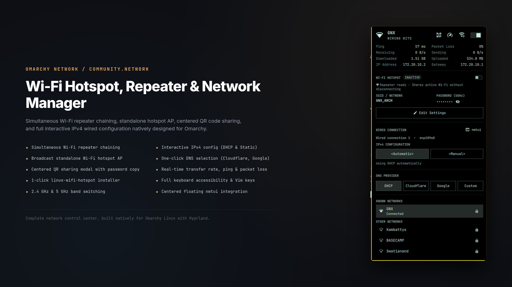
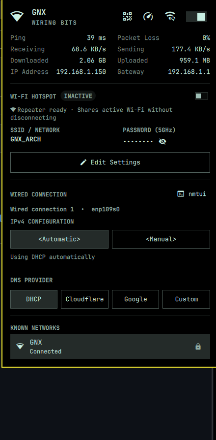
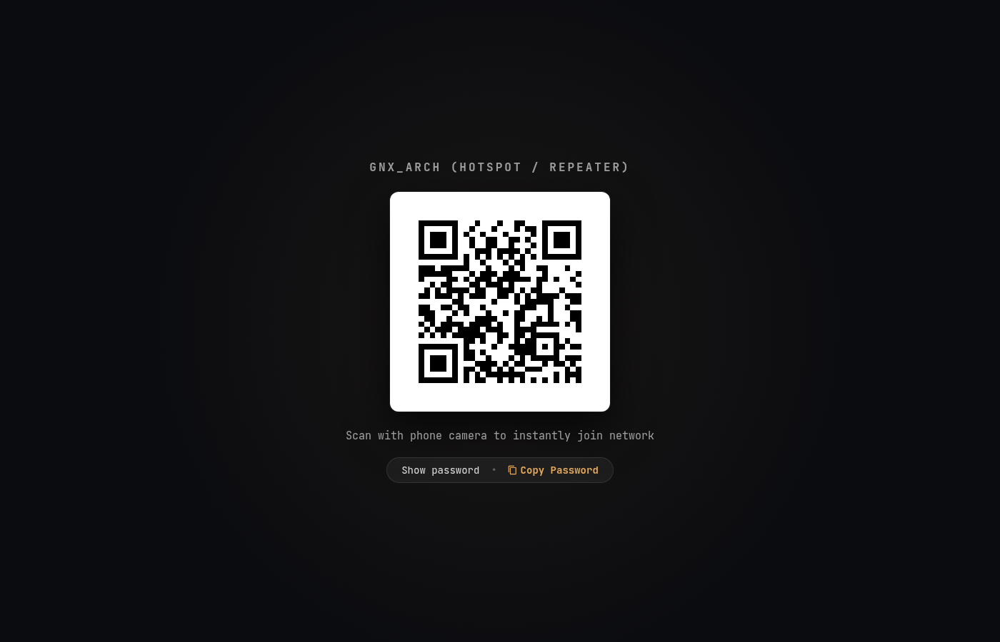
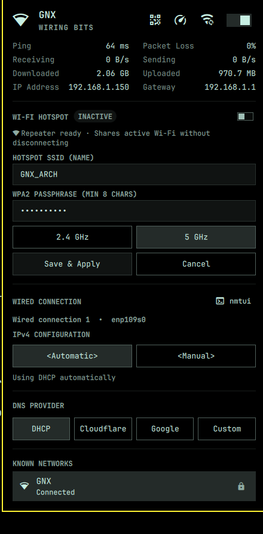

# Network Manager with Wi-Fi Repeater & Hotspot for Omarchy

An enhanced, keyboard-driven Network bar widget and popup control center for the [Omarchy](https://omarchy.org/) Linux desktop shell. Features simultaneous **Wi-Fi Repeater chaining**, standalone **Hotspot AP** with centered **QR code sharing**, 1-click **linux-wifi-hotspot installer**, interactive **Wired Ethernet IPv4 configuration** (DHCP & Static IP), and one-click **DNS provider selection**.



<details>
<summary><b>📸 See additional screenshots</b></summary>

### Network Panel


### Centered Hotspot / Repeater QR Code Sharing


### Hotspot SSID, Password & Band Configuration


</details>

---

## Highlights

- 📡 **Simultaneous Wi-Fi Repeater (Network Chaining)**:
  - Keep your active Wi-Fi connection alive while simultaneously creating and broadcasting a secondary access point to share your network with other devices.
  - Powered by `create_ap` (`linux-wifi-hotspot`) for dual-interface virtual AP chaining.
- ⚡ **1-Click Repeater Backend Installer**:
  - If `linux-wifi-hotspot` is not yet installed on your system, the panel automatically shows an **"Install Repeater"** button.
  - Clicking it immediately launches Omarchy's presented terminal to cleanly install `linux-wifi-hotspot` from the AUR—no manual command typing required.
- 🌐 **Standalone Wi-Fi Hotspot AP**:
  - Broadcast an independent access point via NetworkManager when offline or on Ethernet.
  - Real-time **connected client counter** (`iw station dump`).
  - Pre-flight regulatory checks warning you if your card firmware restricts 5 GHz AP initiation (no-IR).
- 📲 **Centered QR Code Sharing Modal**:
  - Crisp, scannable QR code overlay with deep scrim backdrop on `WlrLayer.Overlay`.
  - Convenient inline **Show/Hide password** reveal and one-click **Copy Password** action.
  - Seamlessly routes from both the main panel action button and the top hero QR action.
- 🔌 **Wired Ethernet IPv4 Configuration**:
  - Real-time Ethernet interface and profile detection via `nmcli`.
  - Instant toggle between **`<Automatic>` (DHCP)** and **`<Manual>` (Static IP)**.
  - Interactive form fields for **Addresses** (CIDR), **Gateway**, and **DNS servers**.
  - Form validation, dirty tracking, and instant Apply/Cancel buttons.
  - Direct hotkey `n` or `N` to open `nmtui` in a floating centered terminal window.
- 🛡️ **DNS Switching**:
  - Switch system DNS in one click between **DHCP**, **Cloudflare**, **Google**, or **Custom**.
- 📊 **Real-time Transfer & Diagnostic Metrics**:
  - Live throughput tracking (KB/s, MB/s delta calculations).
  - Continuous ping latency & packet loss stats to router and internet.
- ⌨️ **Full Keyboard Accessibility**:
  - Navigate every row and button with Arrow keys or Vim keys (`h`/`j`/`k`/`l`).
  - Focus outlines matching Omarchy's active theme.

---

## Installation

Install and enable the plugin using the Omarchy plugin CLI:

```bash
omarchy plugin add https://github.com/Guneshbari/omarchy-network.git --enable
```

To place this widget on your Omarchy status bar, ensure it is configured in `~/.config/omarchy/shell.json`:

```json
{
  "bar": {
    "sections": {
      "right": [
        { "id": "community.network" }
      ]
    }
  }
}
```

Then reload the shell:

```bash
omarchy restart shell
```

---

## Keyboard Navigation

| Key(s) | Context | Action |
|---|---|---|
| `Down` / `j` | Header / Panel | Move focus to next section or row |
| `Up` / `k` | Header / Panel | Move focus to previous section or row |
| `Left` / `Right` or `h` / `l` | Buttons | Switch between pills or action buttons |
| `Enter` / `Space` | Buttons | Activate highlighted button or toggle |
| `Tab` / `Down` | Form Fields | Move to next input field or action button |
| `Shift+Tab` / `Up` | Form Fields | Return to previous field or method row |
| `Escape` | Form Fields / QR Modal | Dismiss modal or cancel form editing |
| `n` / `N` | Panel | Launch `nmtui` in a floating terminal |
| `h` / `H` | Panel | Toggle Wi-Fi Hotspot / Repeater on or off |
| `r` / `R` | Panel | Refresh network status and scan Wi-Fi |
| `w` / `W` | Panel | Toggle Wi-Fi radio on or off |

### Global Shortcut (`SUPER + CTRL + W`)

To map `SUPER + CTRL + W` to open/close this panel (matching Omarchy's `SUPER + CTRL + B` for Bluetooth), add this override to `~/.config/hypr/bindings.lua`:

```lua
hl.unbind("SUPER + CTRL + W")
o.bind("SUPER + CTRL + W", "Network", "omarchy-shell shell toggle community.network")
```

You can assign any custom keybinding to the shell toggle or use direct IPC actions:
- `omarchy-shell shell toggle community.network` — Toggle panel open/close
- `omarchy-shell community.network showHotspotQr` — Open centered Hotspot QR code overlay
- `omarchy-shell community.network speedTest` — Open speed test overlay
- `omarchy-shell community.network toggleNetwork` — Toggle Wi-Fi radio on/off

---

## Dependencies

| Package | Type | Purpose |
|---|---|---|
| `networkmanager` (`nmcli`) | **Required** | Core Wi-Fi scanning, connections, and standard AP |
| `iw` | **Required** | Wi-Fi radio frequencies and connected client counting |
| `jq` | **Required** | JSON query parsing |
| `qrencode` | **Required** | High-contrast ASCII QR code generation |
| `wl-clipboard` (`wl-copy`) | **Required** | Clipboard copying for passwords and IP addresses |
| `linux-wifi-hotspot` | **Optional (`optdepends`)** | Enables simultaneous Wi-Fi repeater chaining while connected to Wi-Fi. *(Can be installed directly via the panel's 1-click button)* |

---

## Uninstallation

To disable and remove the plugin:

```bash
omarchy plugin disable community.network
omarchy plugin remove community.network
```

To restore the default stock network widget, set `"omarchy.network"` in `~/.config/omarchy/shell.json` and reload:

```bash
omarchy restart shell
```

---

## License

[MIT](LICENSE) © 2026 Gunesh Bari
